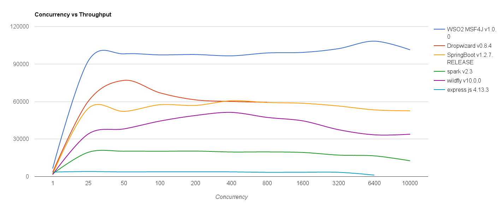
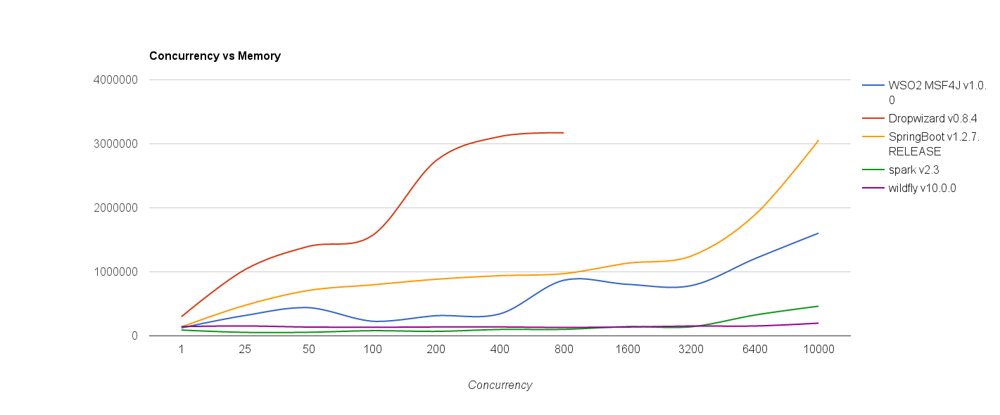

#WSO2 Microservices Framework for Java (MSF4J)

WSO2 Microservices Framework for Java (MSF4J) is a lightweight high performance framework for developing
& running microservices.

WSO2 MSF4J is one of the highest performing lightweight Java microservices frameworks. The following graphs show the 
throughput & memory consumption characteristics of MSF4J against other microservices frameworks.
 
 

An echo service which accepts a 1KB request & echoes it back was developed for the respective frameworks, and requests
were sent for different concurrency values. The test was repeated for each concurrency value for each framework and 
the average throughput was calculated.

 

Memory usage for each framework was observed after running the 1KB payload echo microservice on each framework & 
sending a number of requests at different concurrency levels to each service. 
The graph above shows the averaged out values after several runs for each framework. 

More details about the performance test can found [here](perf-benchmark)

##Getting Started

It is really easy to define & deploy a Java microservice using WSO2 MSF4J. 
You simply need to annotate your service and deploy it using a single line of code. 
Check the following [Hello-Service]
(samples/helloworld) sample.

####pom.xml
This pom file inherits from msf4j-service/pom.xml. It provides a way of setting up things quickly with minimum 
amount of 
configuration. [More info](msf4j-service).

```xml
<project xmlns="http://maven.apache.org/POM/4.0.0"
         xmlns:xsi="http://www.w3.org/2001/XMLSchema-instance"
         xsi:schemaLocation="http://maven.apache.org/POM/4.0.0 http://maven.apache.org/xsd/maven-4.0.0.xsd">

    <parent>
        <groupId>org.wso2.msf4j</groupId>
        <artifactId>msf4j-servicet</artifactId>
        <version>1.0.0</version>
        <relativePath>../../msf4j-service/pom.xml</relativePath>
    </parent>
    <modelVersion>4.0.0</modelVersion>

    <groupId>org.wso2.msf4j.sample</groupId>
    <artifactId>Hello-Service</artifactId>
    <version>1.0.0</version>

    <name>Hello Microservice Sample</name>

    <properties>
        <microservice.mainClass>org.wso2.msf4j.example.Application</microservice.mainClass>
    </properties>

</project>
```

####HelloService.java
This is the hello service implementation that uses JAX-RS annotations.
```java
@Path("/hello")
public class HelloService {

    @GET
    @Path("/{name}")
    public String hello(@PathParam("name") String name) {
        return "Hello " + name;
    }

}
```


####Application.java
This is the one-liner to deploy your service using WSO2 MSF4J.
```java
public class Application {
    public static void main(String[] args) {
        new MicroservicesRunner()
                .deploy(new HelloService())
                .start();
    }
}
```


###Build the Service
Run following Maven command. This will create the uber jar **Hello-Service-1.0.0-SNAPSHOT.jar** in **target** directory.
```
mvn package
```


###Run the Service
You just have to run the following command to get your service up and running.
```
java -jar target/Hello-Service-1.0.0.jar
```


###Test the Service with curl
Run the following command or simply go to [http://localhost:8080/hello/Microservices]
(http://localhost:8080/hello/Microservices) 
from your browser.
```
curl http://localhost:8080/hello/Microservices
```


##Supported Annotations

For defining services, we support a subset of the JAXRS annotations.

###Class level annotations
#####@Path
Root path for resource methods. All the paths specified in the resource methods will be sub paths of this.

#####@Consumes
Default consume media type(s) for resource methods. The resource methods that do not specify @Consume annotation will
 inherit this consume media type(s).

#####@Produces
Default produce media type(s) for resource methods. The resource methods that do not specify @Produce annotation will
inherit this produce media type(s).


###Method level annotations
#####@Path
Endpoint of the resource method relative to @Path of the container resource class.

#####@Consumes
Media type(s) that the method can consume. This overrides the class level @Consumes media types.

#####@Produces
Media type(s) that is produced by the method. This overrides the class level @Produces media types.

#####@GET
HTTP GET method. Specify that the resource method supports HTTP GET method.

#####@PUT
HTTP PUT method. Specify that the resource method supports HTTP PUT method.

#####@POST
HTTP POST method. Specify that the resource method supports HTTP POST method.

#####@DELETE
HTTP DELETE method. Specify that the resource method supports HTTP DELETE method.


###Parameter level annotations
#####@DefaultValue
Specify a default value for a resource method parameter. The value will be automatically converted to the 
corresponding parameter's type.

#####@Context
Inject additional objects to a resource method. Currently supports injection of  following objects.
* org.wso2.msf4j.HttpStreamHandler - 
    This object can be used to stream a chunked request body and process it while the request is streaming. 
* io.netty.handler.codec.http.HttpRequest - 
    This object can be used to retrieve HTTP request information. [More info](http://netty.io/4.0/api/io/netty/handler/codec/http/HttpRequest.html).
* org.wso2.msf4j.HttpResponder - 
    This object can be used to send HTTP responses. You can make responses more clean way by returning an instance of 
    javax.ws.rs.core.Response or a POJO. See the [StockQuote-Service]
    (https://github.com/wso2/msf4j/tree/master/samples/stockquote/fatjar) sample.

#####@PathParam
/StockQuote/{symbol} to get value of symbol. The value will be automatically converted to the corresponding parameter
 type and assigned to that parameter.

#####@QueryParam
/Students?age=18 to get value of age. The value will be automatically converted to the corresponding parameter type 
and assigned to that parameter.

#####@HeaderParam
To read HTTP request header values. The value will be automatically converted to the corresponding parameter type and
 assigned to that parameter.


###Lifecycle Callback Methods
Support following Java lifecycle callback method annotations. 

#####@PostConstruct
Invoke by the container on newly constructed service instances after all dependency injection has completed and before transport starts. 

#####@PreDestroy
Invoke by the container during server shutdown before the  container removes the service instance.

For a detailed example check out the lifecycle sample from [here](https://github.com/wso2/msf4j/tree/master/samples/lifecycle). 


###Complete Feature List
* Annotation based definition of microservices
* High performance Netty based transport
* WSO2 Developer Studio based tooling for microservices development starting from a Swagger API definition
* HTTP request & response streaming
* Support for metrics & visualization of metrics using WSO2 Data Analytics Server (DAS) dashboards
* Support for securing microservices
* Integration with rendering engines such as Mustache
* Comprehensive samples demonstrating how to develop microservices based solutions


