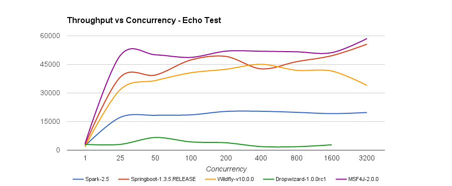
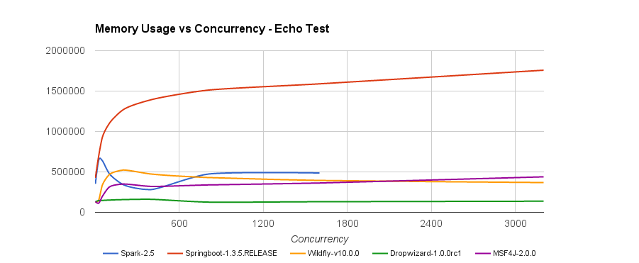
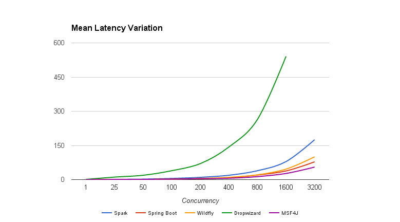

[](https://wso2.org/jenkins/job/msf4j)

#WSO2 Microservices Framework for Java (MSF4J)

WSO2 Microservices Framework for Java (MSF4J) is a lightweight high performance framework for developing
& running microservices.

WSO2 MSF4J is one of the highest performing lightweight Java microservices frameworks. The following graphs show the 
throughput, memory consumption & latency characteristics of MSF4J against other microservices frameworks.
 
 

An echo service which accepts a 1KB request & echoes it back directly and using a temp file was developed for the respective 
frameworks, and requests were sent for different concurrency values. The test was repeated for each concurrency value for each 
framework and the average throughput was calculated. 
Tests were run out of the box without any tuning on 32 core 64GB server in JVM v1.8.0_60 with default configuration.



Memory usage for each framework was observed after running the 1KB payload echo microservice on each framework & 
sending a number of requests at different concurrency levels to each service. 
The graph above shows the averaged out values after several runs for each framework.
 
Latency results was observed using the Apache bench provided percentile values. Results were plotted for 
various concurrency levels the simple echo test. 
  


Tests were run out of the box without any tuning on 32 core 64GB server in JVM v1.8.0_60 with default configuration.

More details about the performance test can found [here](perf-benchmark).

##Hello world with MSF4J

It is really easy to define & deploy a Java microservice using WSO2 MSF4J. 
You simply need to annotate your service and deploy it using a single line of code. 

Let's get started by writing a hello world MSF4J microservice. 

You can use the [msf4j-microservice](archetypes) Maven [archetype](http://maven.apache.org/archetype/maven-archetype-plugin/generate-mojo.html)
 to create your first MSF4J project. 
 Make sure you have JDK 1.8 and Maven 3.x installed, & run the following command.

```
mvn archetype:generate -DarchetypeGroupId=org.wso2.msf4j \
-DarchetypeArtifactId=msf4j-microservice -DarchetypeVersion=2.0.0 \
-DgroupId=org.example -DartifactId=Hello-Service -Dversion=0.1-SNAPSHOT \
-Dpackage=org.example.service -DserviceClass=HelloService
```

This will generate a project structure for you to quickly get started.
Next navigate to the Hello-Service directory. You will find a pom.xml file and also an src directory.

####pom.xml
This pom file inherits from the msf4j-service/pom.xml. It provides a way of setting things up quickly with minimum 
amount of 
configuration. Click [here](poms/msf4j-service) for more information.

```xml
<project xmlns="http://maven.apache.org/POM/4.0.0"
         xmlns:xsi="http://www.w3.org/2001/XMLSchema-instance"
         xsi:schemaLocation="http://maven.apache.org/POM/4.0.0 http://maven.apache.org/xsd/maven-4.0.0.xsd">

    <parent>
        <groupId>org.wso2.msf4j</groupId>
        <artifactId>msf4j-service</artifactId>
        <version>2.0.0</version>
    </parent>
    <modelVersion>4.0.0</modelVersion>

    <groupId>org.example</groupId>
    <artifactId>Hello-Service</artifactId>
    <version>0.1-SNAPSHOT</version>
    <name>WSO2 MSF4J Microservice</name>

    <properties>
        <microservice.mainClass>org.example.service.Application</microservice.mainClass>
    </properties>

</project>
```

You don't need to change anything in this pom.xml file.

####HelloService.java
Change the org.example.service.HelloService class as follows to echo back the name input parameter. 
You can remove the auto generated code and replace it with the following code segment:

```java
package org.example.service; 

import javax.ws.rs.GET;
import javax.ws.rs.Path;
import javax.ws.rs.PathParam;

@Path("/hello")
public class HelloService {

    @GET
    @Path("/{name}")
    public String hello(@PathParam("name") String name) {
        return "Hello " + name;
    }

}
```

####Application.java
This is the one-liner to deploy your service using WSO2 MSF4J.
```java
public class Application {
    public static void main(String[] args) {
        new MicroservicesRunner()
                .deploy(new HelloService())
                .start();
    }
}
```


###Build the Service
Run the following Maven command. This will create the fat jar **Hello-Service-0.1-SNAPSHOT.jar** in the **target** directory.
```
mvn package
```
This fat jar is a jar file that contains your microservice as well as all its dependencies.

###Run the Service
You just have to run the following command to get your service up and running.
```
java -jar target/Hello-Service-*.jar
```


###Test the Service with cURL
Run the following command or simply go to [http://localhost:8080/hello/wso2]
(http://localhost:8080/hello/wso2) from your browser.
```
curl http://localhost:8080/hello/wso2
```

You should see a response that prints "Hello wso2"

##Supported Annotations

In this section, we will look at the annotations used in MSF4J microservices. As you may have already noticed,
 we support a subset of the JAXRS annotations.

###Class level annotations
#####@Path
Root path for resource methods. All the paths specified in the resource methods will be sub paths of this.

#####@Consumes
Default consume media type(s) for resource methods. The resource methods that do not specify @Consume annotation will
 inherit this consume media type(s).

#####@Produces
Default produce media type(s) for resource methods. The resource methods that do not specify @Produce annotation will
inherit this produce media type(s).


###Method level annotations
#####@Path
Endpoint of the resource method relative to @Path of the container resource class.

#####@Consumes
Media type(s) that the method can consume. This overrides the class level @Consumes media types.

#####@Produces
Media type(s) that is produced by the method. This overrides the class level @Produces media types.

#####@GET
HTTP GET method. Specify that the resource method supports HTTP GET method.

#####@PUT
HTTP PUT method. Specify that the resource method supports HTTP PUT method.

#####@POST
HTTP POST method. Specify that the resource method supports HTTP POST method.

#####@DELETE
HTTP DELETE method. Specify that the resource method supports HTTP DELETE method.

#####@HEAD
HTTP HEAD method. Specify that the resource method supports HTTP HEAD method.

#####@OPTIONS
HTTP OPTIONS method. Specify that the resource method supports HTTP OPTIONS method.

###Parameter level annotations
#####@DefaultValue
Specify a default value for a resource method parameter. The value will be automatically converted to the 
corresponding parameter's type.

#####@Context
Inject additional objects to a resource method. Currently supports injection of  following objects.
* org.wso2.msf4j.Request - 
    This object can be used to access properties of the HTTP request. The transport session (org.wso2.msf4j.Session) 
    can also be accessed via org.wso2.msf4j.Request#getSession(). 
    See the [Session-aware service](samples/http-session) sample.
* org.wso2.msf4j.Response - 
    This object can be used to send HTTP responses. You can make responses more clean way by returning an instance of 
    javax.ws.rs.core.Response or a POJO. See the [StockQuote-Service]
    (samples/stockquote/fatjar) sample.
* org.wso2.msf4j.HttpStreamer - 
    This object can be used to stream a chunked request body and process it while the request is streaming. 
    See the [FileServer](samples/fileserver) sample.
* org.wso2.msf4j.formparam.FormParamIterator - 
    This object can be used to stream a HTML form submission request body and process it while the request is streaming. 
    See the [FormParam](samples/formparam) sample.

#####@PathParam
/StockQuote/{symbol} to get value of symbol. The value will be automatically converted to the corresponding parameter
 type and assigned to that parameter.

#####@QueryParam
/Students?age=18 to get value of age. The value will be automatically converted to the corresponding parameter type 
and assigned to that parameter.

#####@HeaderParam
To read HTTP request header values. The value will be automatically converted to the corresponding parameter type and
 assigned to that parameter.
 
#####@CookieParam
Extracts the value from the specified cookie, converts to the corresponding parameter type and assigns the value to 
that parameter.  

#####@FormParam
To support HTML form submission with application/x-www-form-urlencoded and multipart/form-data The value will be 
automatically converted to the corresponding parameter type and assigned to that parameter

#####@FormDataParam
To support complex form submission with multipart/form-data content type. E.g file uploads and beans. The values will be 
automatically converted to the corresponding parameter type and assigned to that parameter

###Lifecycle Callback Methods
Support following Java lifecycle callback method annotations. 

#####@PostConstruct
Invoke by the container on newly constructed service instances after all dependency injection has completed and before transport starts. 

#####@PreDestroy
Invoke by the container during server shutdown before the  container removes the service instance.

For a detailed example, check out the lifecycle sample [here](https://github.com/wso2/msf4j/tree/master/samples/lifecycle). 

##Develop and configure MSF4J services using Spring framework

Spring is a popular Java application development framework which supports concepts like Dependency Injection(DI) 
and Convention over Configuration.  Spring support for MSF4J provides following features. 

1. Develop MSF4J services as Spring beans 
2. Develop and configure MSF4J components such as Interceptors and ExceptionMappers using Spring. 
3. Use Annotation or XML based Spring configuration to configure internals of MSF4J framework such as ports, SSL etc. 

Following example illustrates how to use Spring annotations together with MSF4J annotations to build a RESTful service. The main advantage here is service developers can consume Spring features such as dependency injection , Spring AOP etc. in the Spring way.  

```java
import org.springframework.beans.factory.annotation.Autowired;
import org.springframework.stereotype.Component;

import javax.ws.rs.GET;
import javax.ws.rs.Path;

@Component
@Path("/greeting")
public class Hello {

    @Autowired
    private HelloService helloService;

    @GET
    public String message() {
        return helloService.hello(" World");
    }
}
```

For further details refer Spring [Helloworld sample](samples/spring-helloworld).


##Annotations for Analytics

In this section, we will look at the annotations available for analytics purposes MSF4J microservices. There are annotations 
for Metrics and HTTP Monitoring.

You will need to configure [analytics](analytics) when you want to publish Metrics and HTTP Monitoring events to 
WSO2 Data Analytics Server (DAS).

The Metrics data will be published to WSO2 DAS periodically. However the HTTP Monitoring events are published on each request.

For a detailed example, check out the [Metrics and HTTP Monitoring sample](samples/http-monitoring). 

###Metrics Annotations

You can use the Metrics annnotations in your MSF4J microservices to understand how your microservices work in production.

There are three metrics annotations supported. Those are @Counted, @Metered and @Timed.

Each metric must have a unique name and the MSF4J will use the fully qualified method name as the metric name by default. 
You can give a custom name by using the "name" parameter. This custom name will be appended to the fully qualified method name 
with a dot character. You can set the "absolute" parameter to "true" if you want use only the given name as the metric name. 

For example, see following table to understand how the final metric name is built by the Metrics runtime. Let's asssume that the 
annotation is added to the "hello" method of "HelloService" shown above.

| Metrics Annotation                               | Metric Name                                         |
| ------------------------------------------------ | --------------------------------------------------- |
| @Counted                                         | org.example.service.HelloService.hello              |
| @Counted(name = "helloCounter")                  | org.example.service.HelloService.hello.helloCounter |
| @Counted(name = "helloCounter", absolute = true) | helloCounter                                        |

The Metrics annotations can be used at the Method level and Class level.

You can also configure a level in Metrics Annotations. For more information about Metric Levels, 
see [WSO2 Carbon Metrics](https://github.com/wso2/carbon-metrics). In MSF4J, you can load the metrics level configuration 
via the System Property named `metrics.level.conf`.

#####@Counted
Count the method invocations. There is a parameter named "monotonic" and it is set to false by default. This means that the
counter is decremented when the method returns. This is useful to count the current invocations of the annotated method.

Use `@Counted(monotonic = true)` when you want the counter to increase monotonically. This is useful to count the total invocations 
of the annotated method

#####@Metered
Measure the rate of method invocations. This also keeps a count of the total invocations of the annotated method.

#####@Timed
Maintain a histogram of durations of each method invocation. This also measures the rate of method invocations and keeps a count of the 
total invocations of the annotated method. 

###HTTP Monitoring Annotation

You can use the annotation provided for HTTP Monitoring when you want to monitor each HTTP request and see the summary 
in "HTTP Monitoring Dashboard".

#####@HTTPMonitored
Monitor each HTTP request. This annotation can be used at the Class level and the Method level.

###HTTP Message Tracing
MSF4J supports visual message tracing through user friendly dashboards in WSO2 DAS or Zipkin. MSF4J message tracing provides 
a detailed insight to the complex microservices interactions in a system making monitoring, trouble shooting and optimization of 
microservices very easy. Please check [WSO2 DAS Tracing](samples/message-tracing/das) and [Zipkin Tracing](samples/message-tracing/zipkin) samples for more details.


###Swagger Annotations
[Swagger](http://swagger.io/getting-started/) is a standard, language-agnostic interface to REST APIs which allows both 
humans and computers to discover and understand the capabilities of the service without access to source code, documentation, 
or through network traffic inspection. 

MSF4J supports all [Swagger annotations](https://github.com/swagger-api/swagger-core/wiki/Annotations-1.5.X) out of the box.

In order to retrieve Swagger definitions of your microservice, go to <br/>http://&lt;host&gt;:&lt;port&gt;/swagger?path=&lt;service_base_path&gt;.

e.g. [http://localhost:8080/swagger?path=/hello](http://localhost:8080/swagger?path=/hello)

To retrieve Swagger definitions of all microservices in your runtime, go to http://&lt;host&gt;:&lt;port&gt;/swagger.

e.g. [http://localhost:8080/swagger](http://localhost:8080/swagger)

NOTE: Even without any Swagger annotation, default Swagger definitions will be generated using the JAXRS annotation
in your MSF4J microservice.

The [StockQuote sample](samples/stockquote/fatjar) demonstrates Swagger annotations in action.

### ExceptionMapper 
MSF4J supports [JAXRS ExceptionMapper](https://docs.oracle.com/javaee/7/api/javax/ws/rs/ext/ExceptionMapper.html) 
which allows creation of custom responses when exceptions are thrown from MSF4J services. 

The [StockQuote sample](samples/stockquote/fatjar) demonstrates ExceptionMapper in action.

The following code segment shows how ExceptionMappers are registered with the MSF4J runtime.

```java
new MicroservicesRunner().addExceptionMapper(new SymbolNotFoundMapper(), new DuplicateSymbolMapper());
```

### Circuit Breaker
Nygard's circuit breaker pattern is supported in MSF4J using the Netflix Hystrix library. For more details see the
[circuit breaker sample](samples/circuitbreaker)

###Complete Feature List
* Annotation based definition of microservices
* High performance Netty based transport
* WSO2 Developer Studio based tooling for microservices development starting from a Swagger API definition
* Generate Swagger definition using [Swagger annotations](https://github.com/swagger-api/swagger-core/wiki/Annotations-1.5.X)
* Ability to develop and Configure MSF4J services using Spring framework
* HTTP request & response streaming including support for javax.ws.rs.core.StreamingOutput.
* [ExceptionMapper]((https://docs.oracle.com/javaee/7/api/javax/ws/rs/ext/ExceptionMapper.html))
* Support for metrics & visualization of metrics using WSO2 Data Analytics Server (DAS) dashboards
* Message tracing with WSO2 DAS or Zipkin to get a detailed visual insight to the microservices interactions
* Supports circuit breaker using Netflix Hystrix. 
* Support for securing microservices
* Integration with rendering engines such as Mustache
* Comprehensive samples demonstrating how to develop microservices based solutions
