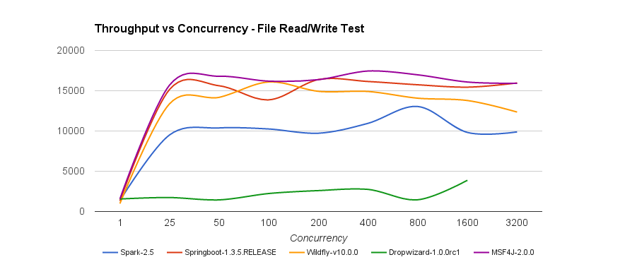
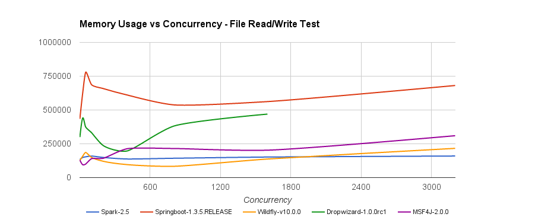
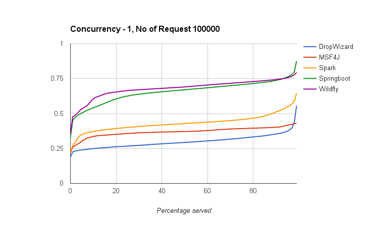
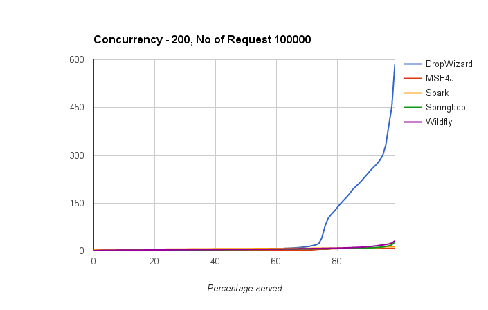
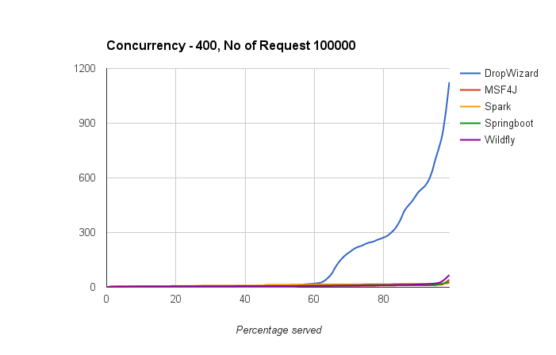

##Echo message performance test

In this performance test, a sample echo service that can accept a payload and respond the same payload back to the 
client was created with each subjected microservices framework. See [echo-samples](echo-samples) directory for the 
sample services that were created for each framework.

## Prerequisite
* **apache2-utils** - This performance tests are executed using ApacheBench. Therefore in order to run the tests, apache2-utils
should be installed in the machine.

## Throughput test

To measure the throughput, each of the above mentioned sample services were started and 1KB of payload was sent to 
each service repeatedly in varying concurrency levels using apache bench tool. After that the average throughput for
each concurrency level is calculated and plotted for each framework.

 
 

All services were run out of the box without any tuning separately on a 32 core 64GB server in JVM v1.8.0_60 with default configuration.

### Performing the throughput test

Build the samples using the following command from [perf-benchmark](perf-benchmark)

```
./run.sh build
```

Run all tests using the following command from [perf-benchmark](perf-benchmark)

```
./run.sh
```

This script will perform the loads and provide you the average throughput, latency and all the percentiles for all the sample services.

You can customize the following parameters of the performance test by modifying the following values in [excecute-tests.sh](excecute-tests.sh)
 * concLevels - Space separated list of concurrency levels to test
 * perTestTime - Maximum time to spend on a single concurrency level
 * testLoops - Number of requests to perform for a sigle concurrency level
 * warmUpConc - Concurrency of the warm-up requests
 * warmUpLoop - Number of requests to send for warm-up


## Memory Test

To measure the memory usage, above mentioned 1KB echo test was performed for each sample service. Then for each 
concurrency level the heap usage was measured and an average value for each concurrency level was calculated. These
average heape usage values were plotted for each framework.




### Performing the memory test

For each service in [echo-samples](echo-samples) directory,
* Build service
* Start the service with GC logging enabled with time stamp (-Xloggc:gc-log-file.log -verbose:gc -XX:+PrintGCDateStamps)
* Perform the test using the automated [run.sh](run.sh) script as mentioned earlier
* Get time range of each concurrency level from the output of the run-test.sh
* Analyse the GC log for each concurrency level by matching the time range and calculate the average heap usage for each concurrency level


## Latency Test

To measure the latency, above mentioned 1KB echo test was performed for each sample service using 3 concurrency levels (1, 200 and 400). Then for each 
concurrency level the latency was measured using apache bench. These values were plotted for each framework.




