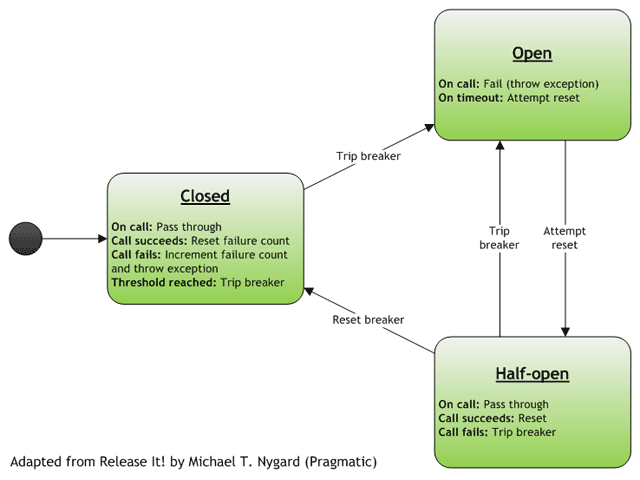
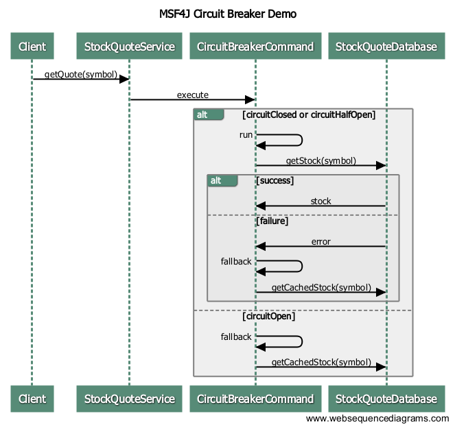

# MSF4J Circuit Breaker Sample

## Introduction
Circuit breaker is a pattern used for fault tolerance and the term was first introduced by Michael Nygard in his 
famous book titled "Release It!". The idea is, rather than wasting valuable resources trying to invoke an operation 
that keeps failing, the system backs off for a period of time, and later tries to see whether the operation that was 
originally failing works.

 

A good example would be, a service receiving a request, which in turn leads to a database call. At some point in time, 
the connectivity to the database could fail. After a series of failed calls, the circuit trips, and there will be no 
further attempts to connect to the database for a period of time. We call this the "open" state of the circuit breaker. 
During this period, the callers of the service will be served from a cache. After this period has elapsed, the next 
call to the service will result in a call to the database. This stage of the circuit breaker is called the "half-open" 
stage. If this call succeeds, then the circuit breaker goes back to the closed stage and all subsequent calls will 
result in calls to the database. However, if the database call during the half-open state fails, the circuit breaker 
goes back to the open state and will remain there for a period of time, before transitioning to the half-open state 
again.

Other typical examples of the circuit breaker pattern being useful would be a service making a call to another service, 
and a client making a call to a service. In both cases, the calls could fail, and instead of indefinitely trying to 
call the relevant service, the circuit breaker would introduce some back-off period, before attempting to call the 
service which was failing.

## About this sample

This sample will demonstrate how a circuit breaker can be implemented using the WSO2 Microservices Framework for Java 
(MSF4J) & Netflix Hystrix. We take the stockquote service sample, and enable circuit breaker. Assume that 
the stock quotes are loaded from a database. We wrap the calls to this database in a Hystrix command. 
If database calls fail, the circuit trips and stock quotes are served from cache.

NOTE: To keep things simple and focus on the implementation of the circuit breaker pattern, 
rather than making actual database calls, we have a class called org.example.service.StockQuoteDatabase and calls 
to its getStock method could result in timeouts or failures. To see an MSF4J example on how to make actual database 
calls, see the [JPA sample](../helloworld-jpa).

The complete call sequence is shown below. StockQuoteService is an MSF4J microservice.



The circuit breaker is configured as shown below.

```java
CircuitBreakerCommand(StockQuoteDatabase db, String symbol) {
    super(HystrixCommand.Setter.withGroupKey(HystrixCommandGroupKey.Factory.asKey("MyGroup"))
            .andCommandPropertiesDefaults(
                    HystrixCommandProperties.Setter()
                            .withCircuitBreakerEnabled(true)
                            .withCircuitBreakerRequestVolumeThreshold(50)
                            .withExecutionTimeoutEnabled(true)
                            .withExecutionTimeoutInMilliseconds(10)
            ));
    this.db = db;
    this.symbol = symbol;
}
```

We are enabling circuit breaker & timeout, and then setting the threshold of failures which will trigger circuit 
tripping to 50, and also timeout to 10ms. So any database call that takes more than 10ms will also be registered as a 
failure. 
For other configuration parameters, please see 
[https://github.com/Netflix/Hystrix/wiki/Configuration](https://github.com/Netflix/Hystrix/wiki/Configuration)

## Building and Running the Sample
Use Maven to build the sample.

```
mvn clean package

```

Next run the MSF4J service.

```
java -jar target/circuitbreaker-*.jar
```
Now let's use cURL to repeatedly invoke the service. Run the following command;

```
while true; do curl -v http://localhost:8080/stockquote/IBM ; done
```

The above command will keep invoking the service. Observe the output of the service in the terminal. 
You will see that some of the calls will fail on the service side and you will be able to see the circuit breaker 
fallback in action and also the circuit breaker tripping, then going into the half-open state, and then closing.
